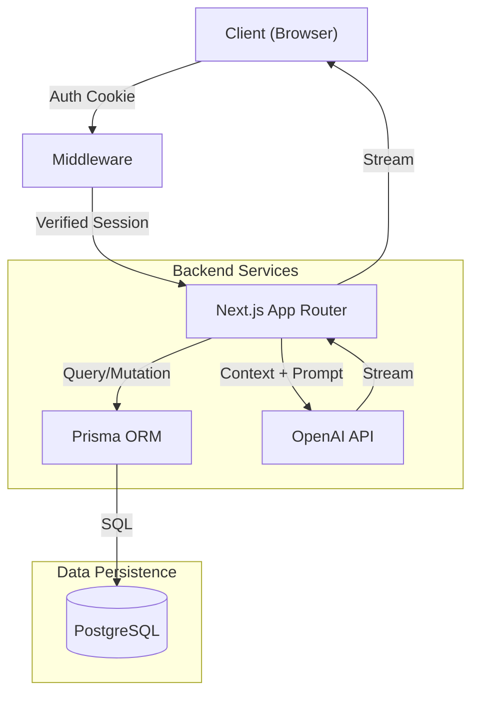

# 🛡️ Aegis: Enterprise AI Chat Platform


> **Aegis is a production-grade, full-stack AI SaaS application featuring secure authentication, real-time response streaming, Redis-backed rate limiting, and long-term conversation memory.**

---

## 🚀 Overview

This project represents a **complete, deployable software product**. It moves beyond simple tutorials to demonstrate advanced full-stack engineering concepts, including custom authentication flows, database schema design, edge-ready API routes, and modern frontend architecture.

Users can sign up, manage multiple chat sessions, and interact with an AI that remembers context—all wrapped in a high-performance, responsive UI.

---

## ✨ Key Features

### 🔐 **Bank-Grade Authentication**
- **Custom Security**: Built-in authentication system (no 3rd party black boxes).
- **Session Management**: Secure HTTP-only cookies for access & refresh tokens.
- **Protection**: Middleware-guarded routes and API endpoints.
- **Encryption**: Bcrypt password hashing and salting.

### ⚡ **Real-Time AI Experience**
- **Streaming Response**: Zero-wait time; text renders character-by-character as the AI thinks.
- **Context Awareness**: The AI "remembers" previous messages in the conversation.
- **Smart Formatting**: Markdown support for code blocks, tables, and lists.
- **AI Memory**: Intelligent persistent memory that allows the AI to recall user preferences and past context across sessions.

### 💾 **Robust Data Architecture**
- **Persistent History**: All conversations are stored in a PostgreSQL database.
- **Prisma ORM**: Type-safe database interactions and automated migrations.
- **Optimized Queries**: Indexed columns for fast history retrieval.

### 🎨 **Modern UX/UI**
- **Responsive Design**: Flawless experience on mobile, tablet, and desktop.
- **Glassmorphism**: Trendy, premium visual aesthetics.
- **Interactive States**: Smooth loading indicators, hover effects, and transitions.
- **Admin Panel**: Dedicated dashboard for user management, usage metrics, and system monitoring.
- **File Management**: Integrated file upload and processing capabilities for AI context.

---

## 🏗️ Architecture



---

## �️ Technology Stack

| Category | Technology | Purpose |
|----------|------------|---------|
| **Frontend** | Next.js 14, React, Tailwind CSS | Server Components, UI, Styling |
| **Backend** | Next.js API Routes, Node.js | Serverless functions, Business Logic |
| **Database** | PostgreSQL, Prisma | Relational Data, ORM |
| **Caching/Rate Limit**| Redis | High-performance caching and rate limiting |
| **AI Engine** | OpenAI API (GPT Models) | LLM Intelligence |
| **Auth** | JWT (JsonWebTokens), Bcrypt | Stateless scalable authentication |
| **Infrastructure** | Docker, Docker Compose | Containerization and orchestration |

---

## 🚦 Getting Started

We have prepared detailed documentation to help you get this project running locally in minutes.

� **[Read the Full Documentation via DOCUMENTATION.md](./DOCUMENTATION.md)**

### Quick Setup

1.  **Clone & Install**
    ```bash
    git clone <repo-url>
    npm install
    ```

2.  **Configure Environment**
    Create a `.env` file with your `DATABASE_URL` and `OPENAI_API_KEY`.

3.  **Run Locally**
    ```bash
    npx prisma db push
    npm run dev
    ```

---

## 📸 Functionality Preview

| **Authentication** | **Dashboard** |
|:---:|:---:|
| Secure Login & Registration | Chat History & New Threads |
| *(Secure implementation)* | *(Prisma + PostgreSQL)* |

| **AI Chat** | **Streaming** |
|:---:|:---:|
| Context-aware conversations | Real-time text generation |
| *(OpenAI Integration)* | *(Edge Runtime)* |

---

## 📄 License & Status

This project is **Complete** and ready for production deployment on platforms like Vercel or Render.

*(c) 2025 AI Chat Platform. All rights reserved.*
